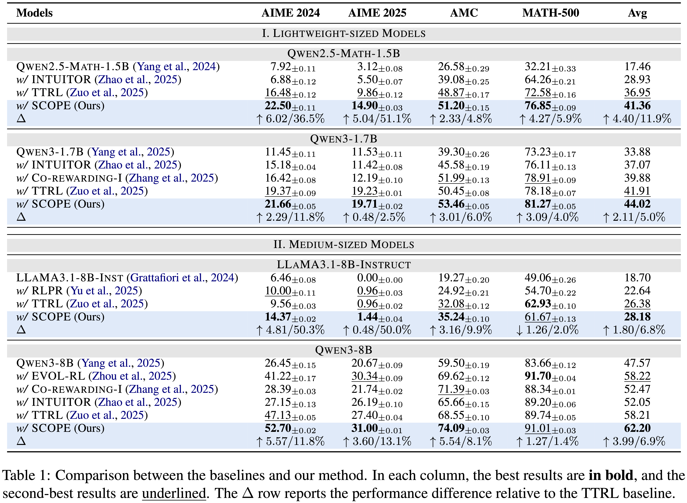

<div align="center">
  
# Beyond Majority Voting: Towards Fine-grained and More Reliable Reward Signal for Test-Time Reinforcement Learning

[]()
[](https://github.com/szu-tera/SCOPE)

🚧 **Code is under preparation and will be released soon.** 🚧

<div align="center" style="font-family: Arial, sans-serif;">
  <p>
    <a href="#news" style="text-decoration: none; font-weight: bold;">🎉 News</a> •
    <a href="#overview" style="text-decoration: none; font-weight: bold;">📌 Overview</a> •
    <a href="#main-results" style="text-decoration: none; font-weight: bold;">📊 Main Results</a>
  </p>
  <p>
    <a href="#getting-started" style="text-decoration: none; font-weight: bold;">✨ Getting Started</a> •
    <a href="#acknowledgements" style="text-decoration: none; font-weight: bold;">🤝 Acknowledgements</a>
  </p>
  <p>
    <a href="#contact" style="text-decoration: none; font-weight: bold;">📨 Contact</a> •
    <a href="#citation" style="text-decoration: none; font-weight: bold;">🎈 Citation</a>
  </p>
</div>

</div>

## 🎉News
- **[2025/12]** We release both the paper and code for SCOPE.

---

## 📌Overview

We propose SCOPE (**S**ubgroup-specific step-wise **CO**nfidence-weighted **P**seudo-label **E**stimation), a test-time reinforcement learning framework that mitigates *confirmation bias* and *reward sparsity* during the unsupervised RL. By leveraging step-wise confidence and dynamic subgroup partitioning, SCOPE provides more reliable supervision and enables diverse, high-quality reasoning exploration. It achieves superior performance across representative reasoning benchmarks, consistently surpassing strong baselines.

<div align="center">
  
</div>

---

## 📊Main Results

Experimental results demonstrate that SCOPE consistently achieves superior performance across diverse model scales. On lightweight models (e.g., Qwen2.5-Math-1.5B), SCOPE effectively filters incorrect reasoning paths despite limited capacity, yielding a remarkable 36.5% relative improvement on the challenging AIME 2024 benchmark compared to TTRL. This advantage scales effectively to medium-sized models; for instance, SCOPE boosts LLaMA-3.1-8B's AIME 2024 performance by 50.3% and enables Qwen3-8B to outperform strong baselines like EVOL-RL by 11.5% on competition-level tasks. Overall, SCOPE demonstrates a strong capability to leverage dense reward signals for rectifying subtle errors, establishing a dominant lead in complex problem-solving scenarios.

<div align="center">
  
</div>

---

## ✨Getting Started

Clone our repository and install the required environment:

```shell
# Clone the repository
git clone https://github.com/szu-tera/SCOPE.git
cd SCOPE
# We use uv to manage the environment
uv sync
# Install SCOPE
uv pip install -e . --no-deps
```

Reproduce the results on AMC 2024 with Qwen3-8B:

```shell
# Preprocess the data
uv run --active python data/preprocess.py
# Run the script
bash examples/SCOPE/Qwen3-8B/amc.sh
```

---

## 🤝Acknowledgements

This project builds upon the following open-source projects:

- [verl: Volcano Engine Reinforcement Learning for LLMs](https://github.com/volcengine/verl)
- [TTRL: Test-Time Reinforcement Learning](https://github.com/PRIME-RL/TTRL)

We sincerely thank the authors and contributors for their valuable work.

---

## 📨Contact

Weiqin Wang: here1swqw@gmail.com

---

## 🎈Citation

If you find this work useful for your research, please consider citing our paper:

```bibtex
@article{wang2025beyond,
  title={Beyond Majority Voting: Towards Fine-grained and More Reliable Reward Signal for Test-Time Reinforcement Learning},
  author={Wang, Weiqin and Wang, Yile and Chen, Kehao and Huang, Hui},
  journal={arXiv preprint arXiv:2512.15146},
  year={2025}
}
```
